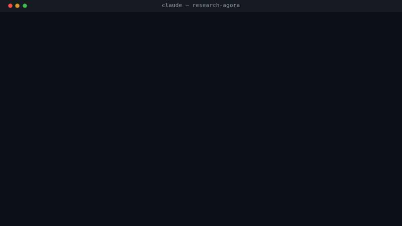
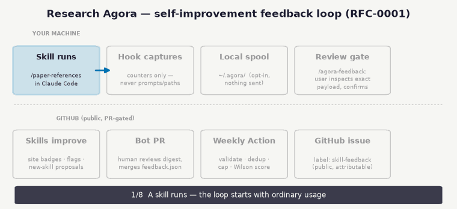

# Research Agora

[](https://github.com/rpatrik96/research-agora/actions)
[](LICENSE)
[](https://rpatrik96.github.io/research-agora)
[](https://www.python.org/downloads/)

A community-driven skills marketplace for AI-assisted research. Browse, install, and share modular AI workflows for ML research.

<p align="center">
  
</p>

**[Browse Skills](https://rpatrik96.github.io/research-agora)** | **[Platform Design](PLATFORM.md)** | **[Contributing](CONTRIBUTING.md)**

## Getting Started

**Reading time:** PI: 5 min | Researcher: 15 min | Student: 10 min

### Install

```bash
npm install -g @anthropic-ai/claude-code    # if you don't have Claude Code yet
```

In a Claude Code session, run:

```
/plugin marketplace add rpatrik96/research-agora
/plugin install verify@research-agora
/plugin install write@research-agora
/plugin install discover@research-agora
/plugin install toolkit@research-agora
```

> **New here?** Run `/onboard` in Claude Code, or [take the 2-minute quiz](https://rpatrik96.github.io/research-agora/onboard.html) in your browser — no installation needed.

### Your First 5 Minutes

Run citation verification on any project with a `.bib` file:

```bash
cd /path/to/your/project && claude
/paper-references
```

Every entry marked `mismatch` or `not found` is a potential hallucinated or corrupted reference. **Cost: ~$0.10–0.30.**

No `.bib` file? No CLI? [Take the onboarding quiz](https://rpatrik96.github.io/research-agora/onboard.html) — it runs in your browser and recommends where to start.

### Choose Your Path

<details>
<summary><strong>PI: Evaluate and deploy for your group</strong></summary>

30 public workflows for the parts of the paper lifecycle a tool can check. **A skill stays in the Agora only if something can check what it produced** — a script that extracts the numbers, a tool that resolves the citation. Where a tool-backed skill and a freehand one do the same job, the tool-backed one is the product. The Agora verifies citations, code-paper consistency, statistics, proofs, and claims. It does not write your claims for you: no oracle exists for novelty or framing, so those stay yours. Skills encode your group's standards in a shared `CLAUDE.md` — every student and postdoc runs the same verified checks.

- **Cost:** $20/mo Pro + ~$5–80/mo API tokens depending on usage. Team plan (see [Anthropic pricing](https://www.anthropic.com/pricing)) includes a GDPR DPA.
- **Privacy:** No patient data or unpublished results on Pro. Team plan required for institutional compliance. [Full guide →](docs/privacy-gdpr.md)
- **Rollout:** (1) Pilot one high-pain task, (2) Create shared `CLAUDE.md`, (3) Set verification standards, (4) Review monthly.
- Skills are plain Markdown — they transfer across providers. No lock-in.

**Start with:** [Quickstart](docs/quickstart.md) → [Verification guide](docs/verification.md) → [CLAUDE.md template](templates/CLAUDE.md.researcher)

</details>

<details>
<summary><strong>Researcher: Get productive today</strong></summary>

| I want to... | Run this |
|-------------|---------|
| Verify citations | `/paper-references` |
| Critical review of my draft | `/paper-review path/to/paper.pdf` |
| Debug LaTeX | `/latex-debugger` |
| Clean up code | `/code-simplify` |

**Not sure which skill?** Run `/choose-skill` — describe your task and get matched recommendations.

**Start with:** [Quickstart](docs/quickstart.md) → [Examples by domain](docs/examples/) → [CLAUDE.md template](templates/CLAUDE.md.researcher)

</details>

<details>
<summary><strong>Student: Learn by doing</strong></summary>

AI tools amplify expertise — they don't replace it. Verify everything. Build understanding before optimizing speed.

**Week 1:** Run `/paper-references` on your bibliography. Check 3 entries manually.
**Week 2:** Set up `CLAUDE.md` for your project with `/onboard`.
**Week 3:** Try `/paper-review` on a section draft. Do you agree with the critique?
**Week 4:** Run `/paper-verify-experiments` against your code. Does the paper say what the repo does?

**Rule of thumb:** If you couldn't do the task without AI, the AI shouldn't do it for you yet.

**Start with:** [Concepts](docs/concepts.md) → [Examples](docs/examples/) → [Verification guide](docs/verification.md)

</details>

### Documentation

| Doc | What it covers |
|-----|---------------|
| [Quickstart](docs/quickstart.md) | Install → first task → 5-minute win |
| [Concepts](docs/concepts.md) | Evolution stack, key terms, delegate vs. protect |
| [Verification](docs/verification.md) | TDR recipes, hierarchy, limits |
| [Privacy & GDPR](docs/privacy-gdpr.md) | Compliance checklist, paid plans, medical data |
| [Examples](docs/examples/) | Domain-specific prompts by use case |
| [CLAUDE.md Template](templates/CLAUDE.md.researcher) | Commented template — customizing it IS the tutorial |

---

## Available Plugins

### discover@research-agora

Decide what to do with checkpoint-gated ideation, personalized onboarding, and skill routing.

```
/plugin install discover@research-agora
```

**Checks against a rubric**

| Skill | Description |
|-------|-------------|
| `brainstorm` | Checkpoint-gated ideation: frame the problem, explore options, and choose a direction with you |

**Produces something for you to check**

| Skill | Description |
|-------|-------------|
| `navigator` | Find the right skill, or find out what changed |
| `onboard` | Personalized Research Agora setup via scripts/onboard.py |

### write@research-agora

Produce and diagnose the draft. These read what you wrote and tell you where it breaks; they do not write your claims.

```
/plugin install write@research-agora
```

**Checks against ground truth**

| Skill | Description |
|-------|-------------|
| `argument-autopsy` | Visualize the logical skeleton of a paper's argument as a claim-evidence DAG |
| `paper-review` | Generate critical reviews of ML paper drafts simulating a skeptical reviewer |
| `writing-verify` | Quantitative writing quality verification for scientific papers |

**Checks against a rubric**

| Skill | Description |
|-------|-------------|
| `audience-checker` | Use this agent to evaluate papers, presentations, posters, or communications for target audience alignment. Im |
| `paper-abstract` | Diagnose abstracts for ML conference papers against structure, venue word limits, specificity, and claim suppo |
| `paper-experiments` | Write experimental details sections for ML papers with GitHub repository integration |
| `voice-drift-detector` | Use this agent to detect voice inconsistency across chapters, blog posts, or documents. Activates when asked t |
| `writing-diagnosis` | Diagnose root causes of bad writing at the paragraph level |

### verify@research-agora

Check what the draft claims.

```
/plugin install verify@research-agora
```

**Checks against ground truth**

| Skill | Description |
|-------|-------------|
| `paper-references` | Fact-check references in ML paper drafts |
| `paper-verify-experiments` | Verify experimental claims in ML papers against source code repositories |
| `pre-submission-audit` | Comprehensive pre-submission paper audit combining reviewer simulation, claim verification, clarity analysis,  |
| `statistical-validator` | Use this agent to verify statistical rigor in ML papers - p-values, confidence intervals, significance tests,  |

**Checks against a rubric**

| Skill | Description |
|-------|-------------|
| `claim-auditor` | Deep verify ALL paper claims with systematic evidence hierarchy. NOW SUPPORTS PARALLEL MODE via parallel-audit |
| `devils-advocate` | Use this agent to challenge arguments, identify logical fallacies, and expose cognitive biases. Supports itera |
| `notation-consistency-checker` | Build a symbol table and check notation consistency throughout a paper. Detects overloaded symbols, undefined  |
| `proof-auditor` | Decompose proofs into logical steps, check each step follows from prior ones, identify assumption usage, and f |

**Produces something for you to check**

| Skill | Description |
|-------|-------------|
| `counterexample-searcher` | Stress-test theorems by systematically exploring what happens when assumptions are dropped or weakened. Genera |
| `theorem-dependency-mapper` | Build a DAG of theorem/lemma/proposition dependencies across the paper. Computes criticality scores, maps assu |

### toolkit@research-agora

The machinery around the paper.

```
/plugin install toolkit@research-agora
```

**Checks against ground truth**

| Skill | Description |
|-------|-------------|
| `code-simplify` | Analyze and refactor Python codebases to remove dead code, eliminate duplication, and simplify complexity |
| `latex` | Build, debug and lint a LaTeX paper |
| `latex-sync` | Keep a paper's equations and the code implementing them in agreement, via the latex-code-sync CLI |
| `rebuttal` | Decode what reviewers actually want, then write the response |

**Checks against a rubric**

| Skill | Description |
|-------|-------------|
| `agora-feedback` | Opt-in, review-gated usage feedback for Research Agora skills (RFC-0001) |
| `artifact-packager` | Use this agent to prepare ML code/data/models for public release with comprehensive checklists. Activates when |

**Produces something for you to check**

| Skill | Description |
|-------|-------------|
| `experiment-tracker` | Sync ML experiment results to paper drafts |
| `figures` | Make publication figures for ML papers, in TikZ or matplotlib |
| `htcondor` | Generate HTCondor submission files and wrapper scripts for ML research jobs |

## Optional: Templates

Some skills use presentation templates. After cloning, install them to your local config:

```bash
mkdir -p ~/.claude/skills/templates
cp -r plugins/write/templates/posters ~/.claude/skills/templates/
```

To add new templates:
```bash
cd templates
python analyze_template.py /path/to/your/template.pptx --output slides --name "template-name"
```

## Optional: bibtexupdater

For the `paper-references` skill:
```bash
pip install bibtex-updater
```

## Domain Context

- **Primary audience:** ML researchers
- **Target venues:** NeurIPS, ICML, ICLR, AAAI
- **LaTeX packages:** cleveref, booktabs, amsmath
- **Figures:** matplotlib/seaborn, colorblind-safe palettes, PDF export

## Community Feedback Loop (opt-in)

The Agora learns which skills earn their place from the people using them — without ever seeing your prompts, files, or paths.

<p align="center">
  
</p>

Capture is **off by default**; `/agora-feedback enable` turns it on locally, and nothing is ever submitted until you inspect the exact payload and confirm. Aggregated scores appear as community badges on the [skills site](https://rpatrik96.github.io/research-agora), and updates to the registry only ever land through a reviewed pull request. Design and privacy details: [RFC-0001](docs/rfcs/0001-agora-feedback-loop.md) and the [privacy guide](docs/privacy-gdpr.md).

## Contributing

See [CONTRIBUTING.md](CONTRIBUTING.md) for guidelines on adding new skills and agents.

## License

MIT License - see [LICENSE](LICENSE) for details.
